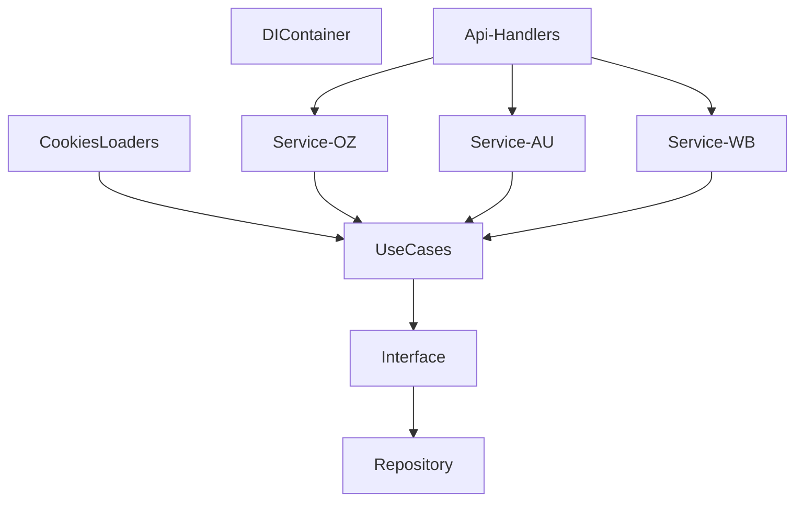

## 1. Описание задания

#### Основные задачи:

+ Источники:
    + https://www.wildberries.ru/
    + https://www.ozon.ru/
    + https://www.auchan.ru/

- [x] Из сайтов источников требуется собрать данные из любой категории:
        ◦ Ссылка на товар
        ◦ Название товара
        ◦ Цена со скидкой
        ◦ Цена без скидки
        ◦ Остатки
- [x] Количество страниц в категории ограничить до 3.
- [x] Обработать возможные ошибки и блокировки.
- [x] Реализовать асинхронный подход как к постраничной пагинации, так и к итерации по ссылкам товаров, так же ограничить число одновременных сетевых запросов.
- [x] Данные сохранить в таблицу PostgreSQL.
- [x] Docker compose.

## 2. Описание сервиса 

Как выглядит сервис

+ Приложение состоит из нескольких слоев:
    + Repository - слой моделями SqlAlchemy и методами чтения/записи в PostgreSQL. Также качестве хранилища используются файлы куки
    + UseCases - слой с бизнес логикой
    + Services - слой с сервисами. Всего сервисов 4: 
       + парсер WB (Wildberries)
       + парсер OZ (Ozon)
       + парсер AU (Auchan)
       + CookiesLoader - скрипт для загрузки и хранения куков для парсера OZ
    + Api Handlers - слой представления, где располагаются ручки
    + DI Container - контейнер, где инициализируются все зависимости
    + Entities - основные сущности, с которыми работает приложение

## 3. Как запустить

+ Запустить приложение виртуального окружения:

  + git clone git@github.com:gMerl1n/test_wb_oz_au_parsers.git
  +  docker-compose up
  + source/venv/bin/activate
  
+ Парсеры запускаются через запросы:
    + /run_wb - WB парсер
    + /run_oz - OZ парсер
    + /load_oz_cookies - загрузить куки для OZ парсера

+ Парсер AU (Auchan) не работает. Чтобы он заработал, нужно:
    + либо обходить qrator защиту и использовать перезапись куки
    + либо платные прокси / динамические прокси

Реализация всего этого требует дополнительного времени.